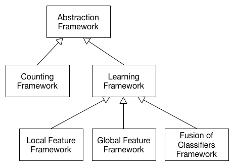

This is my project during Mitacs internship at the university of Saskatchewan. 

# Introduction

The program automatically detects cells in the [ALL-IDB dataset](http://crema.di.unimi.it/~fscotti/all/).

# Proposed Method
## Counting problem

## Classification

# Requirements

1. [numpy](http://www.scipy.org/install.html) >= 1.9 
2. [opencv](http://opencv.org/downloads.html) >= 2.4.10
3. [skimage](http://scikit-image.org/download.html) >= 0.12
4. [matplotlib](http://matplotlib.org/downloads.html) >= 1.4.3
5. [pymorph](http://luispedro.org/software/pymorph/) >= 0.96
6. [spams](http://spams-devel.gforge.inria.fr/downloads.html) (install from source)

# Programs
## Counting Framework

### Usage
Run `python program_nolearing.py -h` for more details about using the program. 

### Examples

`python program_nolearing.py -d training.txt -v`: count all images which are located in file `training.txt` and visualize the result.

`python program_nolearing.py -d training.txt -o result.txt`: count all images which are located in file `training.txt` and write the result to file `result.txt` 

To load data from `training.txt` or `problem.txt`, you must download the dataset and copy all images and xyc files into folder *data*. Because of the copyright of the dataset, I can not make a copy version in this repository.

## Learning Framework
### Usage
Run `python program_fusion.py <training path> <testing-path>`

### Examples

1. `python program_fusion.py train/allidb_1.txt test/allidb_1.txt`

### ALL IDB 2

Because the framework is in progress as well as this version is not the final one. To evaluate the performace of the ALL-IDB 2 dataset, you have to use these scripts which have the "allidb2_" prefix.

For example, to run the fusion of classifiers framework, type this script to your console terminal:

`python allidb2_fusion train/allidb2_1.txt test/allidb2_1.txt`

# Development

